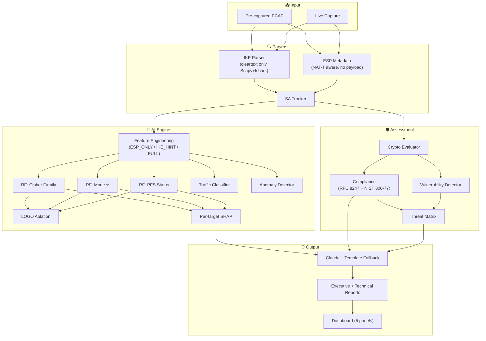

# Plan — IPsec Sentinel

> AI-Powered IPsec VPN Protocol Analyzer & Security Assessment Framework

---

## What We're Building

A framework that **infers cryptographically inaccessible IPsec VPN parameters from ESP side-channel signals**, assesses security posture, and generates reports with honest provenance tracking.

A passive observer **provably cannot** decrypt IKE_AUTH to read Child SA parameters (keys derive from DH shared secret `g^ir`, not PSK — RFC 7296 §2.14). This framework infers those parameters from statistical signals in ESP packet metadata — payload sizes, timing, sequence patterns — that no existing tool exploits.

---

## Protocol-Correctness Constraints

These constraints shape every module. Nothing in the design may contradict them.

### Passive Observer Visibility Boundary

```
┌──────────────────────────────────────────────────────────────────────┐
│  OBSERVABLE (cleartext / metadata)                                   │
│                                                                      │
│  IKE_SA_INIT / Phase 1:                                             │
│    • IKE version (v1/v2), exchange type                             │
│    • IKE SA's OWN crypto: cipher, integrity, PRF, DH group         │
│    • Vendor ID payloads → gateway fingerprinting                    │
│    • NAT-T detection (NAT-D payloads, port 4500)                   │
│    • Auth method (IKEv1 only — Phase 1 SA attribute)                │
│    • Identity leakage in Aggressive Mode (IKEv1)                    │
│                                                                      │
│  ESP header + IP metadata:                                           │
│    • SPI, Sequence Number                                            │
│    • Encrypted payload sizes (per-packet)                            │
│    • Packet timing / inter-arrival times                             │
│    • IP version (4/6), source/dest IPs                              │
├──────────────────────────────────────────────────────────────────────┤
│  INACCESSIBLE — even with PSK                                        │
│                                                                      │
│  Child SA parameters (inside encrypted IKE_AUTH / Quick Mode):      │
│    • ESP encryption algorithm                                        │
│    • ESP integrity algorithm                                         │
│    • Operating mode (Tunnel vs Transport)                            │
│    • PFS status and DH group for Child SA                           │
│    • SA lifetime, replay window                                     │
│    • Auth method (IKEv2 — AUTH payload inside SK{})                 │
│                                                                      │
│  ESP payload content: encrypted                                      │
│                                                                      │
│  Reason: SK_ei/SK_er derived from DH shared secret g^ir, not PSK    │
└──────────────────────────────────────────────────────────────────────┘
```

### Core Technical Contribution — Side-Channel Signals

| Signal | Mechanism | Difficulty |
|--------|-----------|------------|
| **CBC vs GCM** | CBC: `payload_size % 16 ≡ 0` (block cipher guarantee). GCM: fixed 16B AEAD tag, no block padding. | Near-deterministic — protocol arithmetic |
| **Tunnel vs Transport** | Tunnel adds ~20B (IPv4) or ~40B (IPv6) outer header overhead. **Requires `ip_version` as feature.** | Genuinely statistical |
| **PFS status** | Rekeying patterns, DH group correlation from IKE SA hints | Genuinely statistical, hardest |
| **Traffic type** | Packet size distributions and IAT patterns per application | Genuinely statistical |

### Known Limitation: Traffic Flow Confidentiality
RFC 4303 §2.4 permits arbitrary extra padding to obscure payload length. strongSwan default = disabled. State in report: "This technique assumes TFC padding is not in use."

---

## Architecture



---

## Design Decisions

| Decision | Resolution | Rationale |
|----------|-----------|-----------| 
| Ground truth | Config file = truth (single-proposal). `swanctl` = binary establishment check. ESP presence gate blocks bad captures. | No decryption needed. No negotiation ambiguity. |
| Testbed | VM-based, SSH-scripted. 18 configs (12 correlated + 6 decorrelated). | Decorrelated configs prevent IKE-hint leakage. |
| CV methodology | LeaveOneGroupOut by `config_id`. Per-config **accuracy** (not macro-F1). | LOGO: entire config held out. Accuracy: no phantom-class distortion. |
| Ablation headline | Decorrelated configs 13–18 per-config accuracy (ESP-only vs full). | Where IKE hints are actively misleading — the genuine test. |
| RF architecture | 3 separate single-output models (cipher, mode, PFS). | Multi-output averages importances, killing per-target SHAP. |
| GPU | PyTorch CUDA. Assert `torch.cuda.is_available()` only. | Never assert specific GPU model. |
| LLM | Claude Sonnet + Jinja2 template fallback. `--no-ai` flag. | Demo-safe: no WiFi / rate limit / API key risk. |
| Python | ≥ 3.12. Pin in `pyproject.toml`. | PEP 695 generics (`SourcedValue[T]`). |
| Scope | RF-first, CNN-LSTM stretch. 2 compliance standards. 5 dashboard panels. | Right-sized for deliverable timeline. |

---

## VPN Testbed & Dataset

### Testbed Setup

```
┌─────────────────┐     Host-Only (eth0)      ┌─────────────────┐
│    gw-left       │◄───── IPsec Tunnel ──────►│    gw-right      │
│  Traffic Gen     │     tcpdump captures here  │  Responder       │
│         eth1 ────┼──── NAT (SSH only) ───────┼──── eth1         │
└─────────────────┘     ⚠️ NOT for tunnel      └─────────────────┘
```

### 18 Configurations

**Correlated (01–12): IKE SA ≈ Child SA strength**

| # | Mode | ESP Cipher | ESP Integrity | IKE DH | Child DH (PFS) | IP |
|---|------|-----------|---------------|--------|----------------|-----|
| 01 | Tunnel | AES-128-CBC | HMAC-SHA256 | 14 | 14 | v4 |
| 02 | Tunnel | AES-256-CBC | HMAC-SHA384 | 19 | 19 | v4 |
| 03 | Tunnel | AES-128-GCM | (AEAD) | 20 | 20 | v4 |
| 04 | Tunnel | AES-256-GCM | (AEAD) | 21 | 21 | v4 |
| 05 | Transport | AES-128-CBC | HMAC-SHA256 | 14 | 14 | v4 |
| 06 | Transport | AES-256-GCM | (AEAD) | 19 | 19 | v4 |
| 07 | Tunnel | AES-128-CBC | HMAC-SHA256 | 14 | — | v4 |
| 08 | Tunnel | AES-256-CBC | HMAC-SHA256 | 14 | 2 | v4 |
| 09 | Tunnel | 3DES | HMAC-SHA1 | 5 | — | v4 |
| 10 | Tunnel | AES-256-GCM | (AEAD) | 20 | 20 | **v6** |
| 11 | Transport | AES-128-CBC | HMAC-SHA256 | 14 | 14 | **v6** |
| 12 | Tunnel | 3DES | HMAC-MD5 | 2 | — | v4 |

**Decorrelated (13–18): IKE SA ≠ Child SA — hints mislead**

| # | Mode | ESP Cipher | IKE SA Cipher | IKE DH | Child DH | IP |
|---|------|-----------|--------------|--------|----------|-----|
| 13 | Tunnel | AES-128-GCM | AES-256-CBC | 19 | — | v4 |
| 14 | Tunnel | AES-256-GCM | AES-128-CBC | 14 | 20 | v4 |
| 15 | Transport | AES-128-CBC | AES-256-GCM | 21 | 14 | v4 |
| 16 | Tunnel | AES-256-CBC | AES-256-GCM | 20 | — | v4 |
| 17 | Transport | AES-256-GCM | AES-256-CBC | 14 | 19 | v4 |
| 18 | Tunnel | AES-128-CBC | AES-128-GCM | 19 | — | **v6** |

### 6 Traffic Types (per config)

| Type | Tool | Signature |
|------|------|-----------|
| Web | curl/wget loops | Bimodal sizes, bursty |
| VoIP | iperf3 UDP (G.711) | ~160B packets every 20ms |
| Video | iperf3 UDP (RTP) | ~1200B packets, bursty |
| Email | swaks/SMTP+IMAP | Small bursts, long idle |
| Chat | TCP socket ping-pong | Very small, irregular |
| ICMP | ping/ping6 | Fixed-size, regular |

**Total: 18 configs × 6 traffic types = 108 capture runs**

### Capture Pipeline

```
For each config (18):
  For each traffic_type (6):
    1. Deploy swanctl.conf → both VMs (SSH)
    2. swanctl --load-all
    3. swanctl --initiate --child tunnel-child
    4. Poll: grep "ESTABLISHED" (15 attempts, 2s apart)
    5. tcpdump on eth0 (background)
    6. Run traffic generator (--target tunnel-endpoint-IP)
    7. Stop tcpdump → save PCAP
    8. swanctl --terminate
```

### Quality Gates

| Gate | Check |
|------|-------|
| Single-proposal | `grep ',' configurations/*.conf` → must be empty |
| ESP present | `verify_capture_contains_esp()` → blocks bad captures |
| Tunnel established | Poll-until-ESTABLISHED (no blind sleep) |
| Manual dry run | 1 config before 108-run sweep |

---

## Feature Engineering

### ESP_ONLY_FEATURES (19) — no cleartext IKE info

| Feature | Signal For |
|---------|-----------|
| `payload_size_mean/std/min/max/median/skew` | Mode (overhead), traffic type |
| `payload_size_mod16_ratio` ★ | **Cipher** — CBC ≡ 1.0 |
| `payload_size_mod16_variance` | Cipher consistency |
| `has_consistent_tag_size` | GCM ICV detection |
| `spi_entropy` | — |
| `seq_gap_count` | Packet loss |
| `seq_reset_count` ★ | **PFS** — rekeying |
| `iat_mean`, `iat_std` | Traffic type |
| `pkt_count`, `bytes_total`, `flow_duration` | Volume |
| `nat_traversed` | — |
| `ip_version` ★ | **Mode** — 20B vs 40B overhead |

### IKE_HINT_FEATURES (5) — cleartext, correlated hints

`ike_sa_encryption`, `ike_sa_integrity`, `ike_sa_dh_group`, `exchange_type`, `ike_version`

### FULL_FEATURES (24) = ESP_ONLY + IKE_HINT

---

## ML Methodology

### 3 Separate Single-Output RFs

| Model | Target | Difficulty |
|-------|--------|-----------|
| `rf_cipher` | CBC / GCM / 3DES | Near-deterministic |
| `rf_mode` | Tunnel / Transport ⭐ | Genuinely statistical |
| `rf_pfs` | Enabled / Disabled | Hardest target |

### Cross-Validation: LeaveOneGroupOut by config_id

- 18 groups → 18 folds
- Each fold holds out ALL flows from one config
- No config-level data leakage possible
- Traffic classifier: LOGO by `capture_id`

### Per-Config Metric: Accuracy (not macro-F1)

Each config has one true class (single-proposal). `macro-F1` in single-class folds includes phantom classes, distorting scores. Accuracy = fraction correctly classified — the undistorted metric.

### Ablation Study

```python
DECORRELATED_PREFIXES = {"13", "14", "15", "16", "17", "18"}

def is_decorrelated(config_id: str) -> bool:
    return config_id.split("_", 1)[0] in DECORRELATED_PREFIXES
    # NOT lstrip("0") — that doesn't extract a numeric prefix
```

Two models per target: `rf_full` (24 features) vs `rf_esp` (19 features, no IKE hints).

**Headline evidence:** Per-config accuracy on configs 13–18 (decorrelated), where IKE hints are actively misleading. High ESP-only accuracy here proves genuine side-channel signal.

`assert len(decorrelated_full) == 6` — hard fail on naming changes.

### Interpretation

Both outcomes are valid:
- ESP-only ≈ Full on 13–18 → ✅ Genuine side-channel signal
- ESP-only << Full on 13–18 → ⚠️ Depends on IKE hints
- ESP-only >> Full on 13–18 → 🔍 IKE hints actively mislead

The ablation itself is the contribution.

### Caveats

- **3DES:** Only 2/18 configs — report as "qualitative spot-check"
- **Mode balance:** 13 Tunnel / 5 Transport — per-class F1 is the meaningful pooled number
- **IPv6:** 3 configs (10, 11, 18) — keep IPv6 and decorrelated evidence separate (non-overlapping subsets)
- **Calibration:** Cipher-family is near-deterministic (structural). Lead with "Mode and PFS are the genuinely statistical tasks."

---

## Security Assessment

### Crypto Evaluator
- Confidence-weighted: `parsed_cleartext` → full weight, `ml_inferred` → × model confidence, `not_observed` → excluded
- Security Score: 0–100

### Compliance
- RFC 8247 — MUST/SHOULD/MAY with verified clause refs
- NIST SP 800-77 Rev.1 — configuration guidance
- CNSA 2.0 — illustrative only

### Vulnerability Detector
- Cleartext-sourced (confidence 1.0): Aggressive Mode, weak DH, deprecated ciphers
- ML-sourced (with model confidence): weak ESP cipher, transport mode, missing PFS
- Sequence-based (rule): SPI reuse, wrap-around, replay

### Threat Matrix
- Risk = Σ(likelihood × impact), normalized 0–100
- ML findings: likelihood scaled by model confidence

---

## Reports

### Executive Report
Security/Risk score gauges, executive summary (LLM or template), critical findings with source annotations, compliance summary, prioritized remediation

### Technical Report
SA inventory, ablation study (pooled + per-config + decorrelated headline), per-target SHAP plots, calibration statement, rare-class caveat, IPv6 evidence (separate), vulnerability listing, compliance breakdown, TFC limitation, CV methodology, remediation config snippets

### LLM Advisor
Claude Sonnet primary, Jinja2 template fallback. `--no-ai` flag for demo safety.

---

## Dashboard — 5 Panels

| Panel | Content |
|-------|---------|
| Security Score Gauge | 0–100 radial, color-coded |
| SA Overview Table | IKE SA (cleartext) + inferred Child SA with confidence badges |
| Threat Matrix | Heatmap with triggering findings |
| Traffic Classification | Pie/bar + per-class confidence |
| AI Insights | LLM or template output, expandable |

FastAPI + HTMX + Plotly + Tailwind CSS

---

## CLI

```
ipsec-analyzer analyze <pcap>             # Full pipeline
ipsec-analyzer analyze --live <iface>     # Live capture
ipsec-analyzer train <dataset_dir>        # Train models
ipsec-analyzer report <results.json>      # Generate reports
ipsec-analyzer dashboard                  # localhost:8000
ipsec-analyzer dataset build <pcap_dir>   # Build features
```

Flags: `--output`, `--format`, `--compliance`, `--no-ai`, `--device cuda|cpu`, `--verbose`, `--config`

---

## Implementation Order

| Phase | Deliverable | Key Gate |
|-------|------------|----------|
| **1** | `pyproject.toml`, `config/`, `models.py`, `__init__.py` files | Python 3.12 verified |
| **2** | `packet_loader.py`, `ike_parser.py`, `esp_parser.py`, `ah_parser.py`, `sa_tracker.py` | **Day 1 Scapy smoke test** |
| **3** | `crypto_evaluator.py`, `compliance_checker.py`, `vulnerability_detector.py`, `threat_matrix.py` | Clause refs verified |
| **4** | 18 configs, traffic scripts, `run_testbed.sh`, `label_pcaps.py`, `dataset_builder.py` | **Manual dry run**, grep for commas |
| **5** | `feature_engineering.py`, `protocol_identifier.py` (3 RFs + ablation), `traffic_classifier.py`, `anomaly_detector.py`, `explainability.py` | **Ablation immediately**, assert 6 decorrelated |
| **6** | `llm_advisor.py`, `report_generator.py`, templates, `json_exporter.py` | `--no-ai` fallback tested |
| **7** | `app.py`, dashboard, `main.py`, tests, `README.md` | E2E integration test |

---

## Dependencies

| Package | Version | Purpose |
|---------|---------|---------|
| `scapy` | ≥2.6 | Packet parsing |
| `scikit-learn` | ≥1.5 | RF, Isolation Forest, CV |
| `torch` | ≥2.3+cu121 | CNN-LSTM (CUDA) |
| `pandas` | ≥2.2 | Features |
| `numpy` | ≥1.26 | Numerical |
| `anthropic` | ≥0.40 | Claude API |
| `fastapi` | ≥0.115 | Dashboard |
| `uvicorn` | ≥0.30 | ASGI server |
| `jinja2` | ≥3.1 | Templates |
| `plotly` | ≥5.24 | Charts |
| `click` | ≥8.1 | CLI |
| `rich` | ≥13.9 | Terminal output |
| `pyyaml` | ≥6.0 | Config |
| `shap` | ≥0.46 | Explainability |
| `joblib` | ≥1.4 | Model persistence |
| `pydantic` | ≥2.9 | Validation |
| `matplotlib` | ≥3.9 | Report charts |

---

## Verification

### Pre-Flight
```bash
python3 -c "import sys; assert sys.version_info >= (3, 12)"
python3 -c "from scapy.contrib.ikev2 import IKEv2; print('OK')"
python3 -c "import torch; assert torch.cuda.is_available()"
grep -E 'esp_proposals|proposals' testbed/configurations/*.conf | grep ','
```

### Test Suite
```bash
pip install -e ".[dev]"
pytest tests/ -v --tb=short --cov=ipsec_analyzer
mypy src/ipsec_analyzer/
ruff check src/
```

### Model Evaluation

| Model | Pooled Metrics | Per-Config Metric | CV | Headline |
|-------|---------------|-------------------|-----|----------|
| `rf_cipher` | Per-class F1, macro-F1 | **Accuracy** | LOGO | Configs 13–18 ESP-only acc |
| `rf_mode` | Per-class F1, macro-F1 | **Accuracy** | LOGO | **Configs 13–18 ESP-only acc** |
| `rf_pfs` | Per-class F1, macro-F1 | **Accuracy** | LOGO | Configs 13–18 ESP-only acc |
| Traffic | Per-class F1, macro-F1 | — | LOGO by capture_id | — |
| Anomaly | Precision, Recall | — | — | Recall ≥ 0.90 |

### E2E Integration
- PCAP → Parse → Assess → Classify → Report → Dashboard
- Decorrelated configs → ML inference differs from IKE SA cleartext
- `--no-ai` → template fallback produces complete report
- Rejected captures (no ESP) → no label file generated
